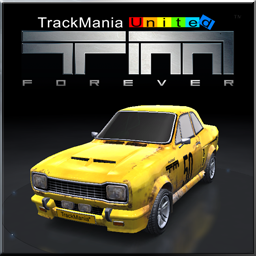

<h1 align="center">
  
   
  Trackmania United Forever (FORKED)
</h1>

<b>This is the modified snap for Trackmania United Forever</b>. It's been tested in Ubuntu 18.04 so far, but since no substantial changes have been made, it should work with other distros too. Feel free to unpack and compare with the original snap.

Published for  with :gift_heart: by Snapcrafters, modified by seffplusplus

EXPERIMENTAL!

([Make sure you have snap installed first](https://snapcraft.io/docs/core/install))

## How to install

  * snap install tmunitedforever --edge
  * snap connect tmunitedforever:joystick
  * snap connect tmunitedforever:pulseaudio
  * After installation it will ask for player key, close and run tmunitedforever.launcher to paste it

## tmunitedforever: command not found

  *  Navigate to /var/lib/snapd/desktop/applications
  *  Execute TmUnitedForever
  *  Wait for installation to complete
  *  (Once up and running, right-click and add to Favorites)

